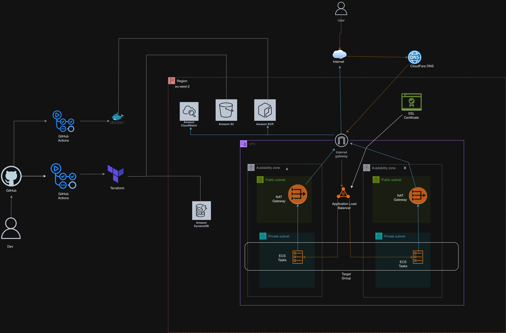

# End to End Production Grade Deployment on AWS ECS Fargate - [Go Application]

This project demonstrates a **production-grade deployment of a Go application on AWS ECS Fargate**, with **all infrastructure provisioned using Terraform** and a **fully automated CI/CD pipeline using GitHub Actions**.

The setup follows modern DevOps best practices: modular Infrastructure as Code, private networking, secure image delivery, HTTPS termination, automated security scanning, and remote Terraform state management.

Chechout my blog on the full system design and technical breakdown [here.](https://mazinhanafi1.substack.com/p/building-an-end-to-end-production)

## Architecture Overview



### Live Deployment 

https://github.com/user-attachments/assets/2b846055-5dba-4a77-bd15-e76a9c85e2e4

### Deployment Verification

- [View healthy Target Group on AWS Console](./assests/healthy-target-group.png)
- [View healthy ALB DNS](./assests/healthy-alb-dns.png)
- [View live domain](./assests/live-domain.png)

The architecture is designed for **high availability, security, and scalability**:

- Multi-AZ VPC with public and private subnets  
- Internet-facing Application Load Balancer (HTTPS)  
- ECS Fargate tasks running in private subnets  
- Outbound internet access via NAT Gateways  
- TLS certificates issued by ACM and DNS-validated via Cloudflare  
- Container images stored in private Amazon ECR  
- Centralised logging with CloudWatch  
- Fully automated CI/CD pipeline  

## Repository Structure

```text
ecs/
├── .github/workflows
│    ├──  apply.yml
│    ├──  destroy.yml
│    ├── docker-build-push.yml
│    └── scan-init-plan.yml
│    
│
├── assests/
│    ├──apply-pipeline-success.png
│    ├──build+push-pipeline-success.png
│    ├──ecs-architecture.png
│    ├──healthy-alb-dns.png
│    ├──healthy-target-group.png
│    ├──live-domain.png
│    ├──scan+init+plan-pipeline-success.png
│    └──triy-results-artifact-success.png
│    
├── gatus/
│     ├── ...
│     ├── Dockerfile
│     ├── .dockerignore
│     └── ...
│
│    
├── infra/
│  ├── modules/
│  │   ├── acm/
│  │   │   ├── main.tf
│  │   │   ├── outputs.tf
│  │   │   └── variables.tf
│  │   ├── alb/
│  │   │    ├── main.tf
│  │   │    ├──outputs.tf
│  │   │    ├── outputs.tf
│  │   │    └── variables.tf
│  │   ├── dns/
│  │   │    ├── main.tf
│  │   │    ├── outputs.tf
│  │   │    ├── variables.tf
│  │   │    └── versions.tf
│  │   ├── ecs/
│  │   │    ├── main.tf
│  │   │    ├── outputs.tf
│  │   │    └── variables.tf
│  │   ├── iam/
│  │   │    ├── main.tf
│  │   │    ├──outputs.tf
│  │   │    └── variables.tf
│  │   └── vpc/
│  │        ├── main.tf
│  │        ├── outputs.tf
│  │        └── variables.tf
│  │
│  │  
│  ├── backend.tf
│  ├── data.tf
│  ├── main.tf
│  ├── outputs.tf
│  ├── provider.tf
│  └── variables.tf
│
├── .gitignore
└── README.md
```

## Infrastructure Components

### Networking
- Custom **VPC** spanning multiple Availability Zones
- **Public subnets** for ALB and NAT Gateways
- **Private subnets** for ECS tasks
- **NAT Gateways** for secure outbound access
- Route tables and security groups scoped by responsibility

### Compute & Containers
- **Amazon ECS (Fargate)** for serverless container execution
- **Private ECR repository** for container images
- Task definitions updated automatically per deployment
- Stateless containers with immutable image versions

### Load Balancing & TLS
- **Application Load Balancer**
- HTTP → HTTPS redirect
- **ACM-managed TLS certificates**
- DNS validation handled via **Cloudflare**

### Observability
- **CloudWatch Logs** for ECS task logging
- Structured logging from the Go application
- ALB health checks to ensure task availability

### State Management
- **Remote Terraform state** stored in Amazon S3
- Native Terraform state locking enabled
- Safe concurrent execution in CI/CD


## CI/CD Pipeline (GitHub Actions)

The project uses **multiple GitHub Actions workflows** to enforce quality and safety:

### 1. Infrastructure Scanning & Planning
Triggered on repository changes:
- **TFLint** — Terraform best practices
- **Checkov** — Infrastructure security scanning
- **Trivy** — Container vulnerability scanning
- `terraform fmt`, `validate`, and `plan`

### 2. Apply
Triggered only after all previous stages succeed:
- Applies Terraform changes
- Updates ECS task definitions with new image references
- Rolls out changes safely via the ALB without downtime

### Evidence of Successful Pipelines

- [View Successful Docker Build & Push Pipeline](./assests/build+push-pipeline-success.png)
- [View Successful Scan, Plan and Init Pipeline](./assests/scan+init+plan-pipeline-success.png)
- [View Successful Apply Pipeline](./assests/apply-pipeline-success.png)
- [View Successful Destroy Pipeline](./assests/destroy-pipeline-success.png)
- [View Trivy Table published as artifact](./assests/trivy-results-artifact.png)


Authentication to AWS is handled using **GitHub OIDC**, eliminating long-lived AWS credentials.


## Tech Stack

### Infrastructure & Cloud
- **AWS**: VPC, ECS (Fargate), ECR, ALB, ACM, CloudWatch, S3
- **Cloudflare**: DNS & ACM validation
- **Terraform**: Modular Infrastructure as Code

### CI/CD & Security
- **GitHub Actions**
- **OIDC** for AWS authentication
- **Trivy** (container scanning)
- **Checkov** (IaC security)
- **TFLint** (Terraform linting)

### Application
- **Go (Golang)**
- **Docker**


## Terraform Design

- Fully **modular Terraform architecture**
- Clear separation of concerns:
  - Networking
  - Load balancing
  - Compute
  - IAM
  - DNS & certificates
- Minimal hard-coded values
- Environment-specific values injected via variables
- Outputs explicitly passed between modules
- Explicit dependency management via outputs and module inputs


## Run Locally

### Prerequisites
- Go
- Docker
- AWS CLI (for ECR login if testing images)
- Terraform

### Run the Application
```bash
cd gatus
go run .
```

## Build Docker Image 
```bash
docker build -f gatus/Dockerfile -t app:local .
docker run -p 8080:8080 app:local
```
## Security Considerations

- No secrets committed to version control
- Private subnets for application workloads
- IAM roles scoped to least privilege
- TLS enforced end-to-end
- Automated security scanning in CI/CD
- Immutable container deployments


## Key Learnings

- Designing **clean Terraform module interfaces**
- Managing **state safely in CI/CD**
- Handling **image versioning and deployments**
- Debugging ECS networking and IAM issues
- Using **OIDC** for secure GitHub → AWS authentication
- Building resilient pipelines with scan → plan → apply stages
- Designing CI/CD pipelines that safely propagate image versions into infrastructure


## Future Improvements

- Blue/Green or Canary deployments
- Autoscaling based on metrics
- Structured application metrics (Prometheus)
- WAF integration
- Multi-environment support (dev/staging/prod)


